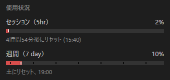
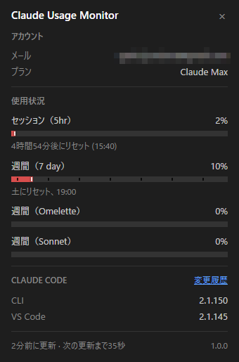
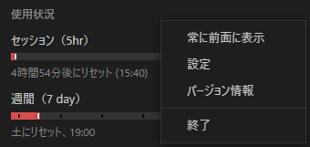
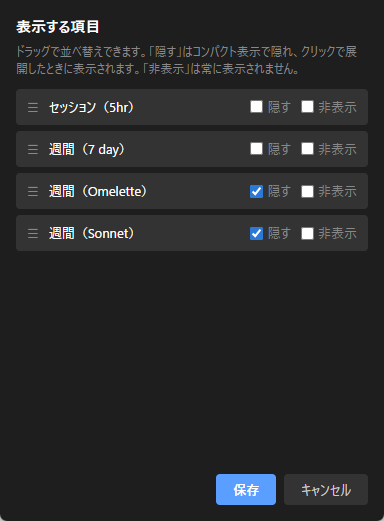

# Claude Usage Monitor

> Claudeの使用量を常時画面に表示する、常駐型のデスクトップウィジェット（Windows）。
> A resident, always-on-top desktop widget that keeps your Claude usage on screen (Windows).

**[日本語](#日本語) ・ [English](#english)**

本アプリは Jens Duttke 氏の [Usage Monitor for Claude](https://github.com/jens-duttke/usage-monitor-for-claude) のフォークです。素晴らしい原作に深く感謝します。
This app is a fork of [Usage Monitor for Claude](https://github.com/jens-duttke/usage-monitor-for-claude) by Jens Duttke. With sincere gratitude to the original work.

### スクリーンショット / Screenshots

<table>
<tr>
<td align="center" valign="top"><br><sub><b>コンパクト表示</b>：使用量バーだけ<br><b>Compact</b>: just the usage bars</sub></td>
<td align="center" valign="top"><br><sub><b>クリックで展開</b>：詳細を表示<br><b>Click to expand</b>: full details</sub></td>
</tr>
<tr>
<td align="center" valign="top"><br><sub><b>右クリックメニュー</b><br><b>Right-click menu</b></sub></td>
<td align="center" valign="top"><br><sub><b>設定ウィンドウ</b>：3状態＋並べ替え<br><b>Settings</b>: 3-state fields + reorder</sub></td>
</tr>
</table>

---

<a id="日本語"></a>

## 日本語

claude.ai・Claude Code・各IDE拡張で共有されるレート制限の残量を、デスクトップ上に常時表示します。本家のトレイ常駐＋詳細ポップアップに加えて、**閉じない常駐ウィジェット**として使えるように拡張したフォークです。

### 本フォークで追加・変更した点

- **常駐ウィジェット**：ポップアップが閉じず、常に前面に表示され続けます
- **コンパクト表示／クリックで展開**：通常は使用量バーだけをコンパクトに表示。クリックすると詳細（アカウント・隠し項目・更新状況など）が開きます
- **位置を記憶**：ウィンドウ位置を `ClaudeUsageMonitor.ini` に保存し、次回起動時に復元。ドラッグで自由に移動でき、画面外の座標は自動で見える位置に補正。初回はなければ画面中央に表示
- **右クリックメニュー**：常に前面に表示（切替）／設定／バージョン情報／終了
- **設定ウィンドウ**：表示する使用量項目を「表示／隠す／非表示」の3状態で選び、ドラッグで並べ替え。結果は ini に保存
- **レジストリ不使用**：設定・状態はすべて exe と同じフォルダのファイルに保存します
- **バージョン情報**：クリック可能なリンク付き（タスクダイアログ）

### 本家から引き継いだ主な機能

- 使用量バー（セッション・週次・Sonnet・Opus・Cowork など、APIが返す項目を動的表示）
- しきい値アラート（経過時間を考慮するスマートモード対応）・リセット通知
- OAuthトークンの自動更新（期限切れ時に `claude update` をバックグラウンド実行）
- 状況に応じた適応的ポーリング（アクティブ時は高頻度、アイドル／ロック時は休止）
- 13言語対応（Windowsの表示言語から自動判定、手動上書きも可）
- イベントコマンド（リセット・しきい値・起動時に任意コマンドを実行）

### 必要環境

- **Windows 10 / 11（64bit）**
- **[Claude Code](https://docs.anthropic.com/en/docs/claude-code)** がインストール済みでログイン済みであること（CLI・VS Code拡張・JetBrainsプラグインのいずれでも可）。本アプリは Claude Code がローカルに保存したOAuthトークン（`~/.claude/.credentials.json`、`CLAUDE_CONFIG_DIR` 指定時はそちら）を読み取ります。

### 入手と実行

**単体のexeだけで動きます。** インストール不要・追加ファイル不要です。`ClaudeUsageMonitor.exe` を好きな場所に置いて実行するだけです。設定・状態ファイル（後述）は必要に応じて exe と同じフォルダに作られますが、いずれも任意で、無くても既定値で動作します。

- プレビルド版は本リポジトリの [Releases](https://github.com/omi-last-stand/claude-usage-monitor/releases) から入手できます（公開されている場合）。
- 自分でビルドする場合は後述の「ソースからビルド」を参照してください。

> [!TIP]
> 常駐ウィジェットとして使う場合は、設定ファイルに `{"widget_mode": true}` を指定します（「設定」の項を参照）。

### 使い方

| 操作 | 動作 |
|---|---|
| ウィジェットを**クリック** | コンパクト表示と詳細表示を切り替え |
| ウィジェットを**ドラッグ** | 自由に移動（位置は記憶されます） |
| **右クリック** | メニュー（常に前面に表示／設定／バージョン情報／終了） |
| ウィジェットの**外側をクリック** | 開いている右クリックメニューを閉じる |

「設定」を開くと、表示する使用量項目を選べます。各項目について「**隠す**」（コンパクト時は隠し、クリックで展開したときに表示）と「**非表示**」（常に表示しない）をチェックでき、行をドラッグして並び順を変更できます。

### 設定

設定・状態は **exe と同じフォルダ** のファイルに保存します（レジストリは一切使いません）。どちらも任意で、無ければ既定値で動作します。

- **`ClaudeUsageMonitor.ini`** … アプリが自動生成・更新するウィジェットの状態（ウィンドウ位置、常に前面の有無、項目の表示設定）。「設定」ウィンドウやドラッグ操作の結果がここに保存されます。
- **`usage-monitor-settings.json`** … 任意の詳細設定（ポーリング間隔・配色・アラートしきい値・言語・イベントコマンドなど）。ユーザーが手動で作成するファイルで、アプリが書き換えることはありません。

例（`usage-monitor-settings.json`）：

```json
{
  "widget_mode": true,
  "poll_interval": 180,
  "bar_fg": "#00cc66"
}
```

詳細設定の一覧は [docs/configuration.md](docs/configuration.md)、イベントコマンドは [docs/event-commands.md](docs/event-commands.md) を参照してください（本家から引き継いだ仕様です）。

### セキュリティと透明性

OAuthトークンを扱うため、安全性を検証できるよう配慮しています。

- **通信先は `api.anthropic.com` のみ**。他のホストとは通信しません
- **認証情報はローカルのみ**：OAuthトークンはHTTPのAuthorizationヘッダーにのみ使用し、ログ・ファイル・第三者への送信は一切行いません
- **書き込むのは自分の設定・状態だけ**：exe と同じフォルダの `ClaudeUsageMonitor.ini`（ウィンドウ位置・常に前面・項目表示）のみを書き込みます。認証情報や使用量の値をディスクに書くことはありません
- **レジストリ不使用**：自動起動の設定もスタートアップフォルダのショートカットで行い、レジストリには触れません
- **動的コード実行なし**（`eval`・`exec` 等を使用しません）・**難読化なし**
- **依存は最小限**：[requests](https://pypi.org/project/requests/)・[Pillow](https://pypi.org/project/pillow/)・[pystray](https://pypi.org/project/pystray/)・[pywebview](https://pypi.org/project/pywebview/) のみ

### ソースからビルド

<details>
<summary>自分でexeをビルドする場合</summary>

必要なもの：Python 3.10以上、pip。

```bash
git clone https://github.com/omi-last-stand/claude-usage-monitor.git
cd claude-usage-monitor
python -m venv .venv
.venv\Scripts\activate
pip install -r requirements.txt
```

ソースから実行：

```bash
python -m usage_monitor_for_claude
```

exeをビルド：

```bash
python build.py
```

`dist/ClaudeUsageMonitor.exe`（約15MB）が生成されます。Pythonと全依存を内包した単一ファイルです。

</details>

### 謝辞

本アプリは Jens Duttke 氏の素晴らしい [Usage Monitor for Claude](https://github.com/jens-duttke/usage-monitor-for-claude) をベースにしています。心より感謝します。

### ライセンス

[MIT License](LICENSE)。本家 Jens Duttke 氏の著作権表示を保持しつつ、フォーク側の著作権を併記しています。

### 免責

本プロジェクトは独立した有志による非公式のものです。[Anthropic](https://www.anthropic.com/) による作成・承認・公式サポートを受けたものではありません。「Claude」「Anthropic」は Anthropic, PBC の商標です。名称は互換性を示す説明目的でのみ使用しています。

---

<a id="english"></a>

## English

Claude Usage Monitor shows your Claude rate-limit usage on the desktop at a glance. Rate limits are shared across claude.ai, Claude Code, and the IDE extensions. This is a fork that extends the original tray app and detail popup into a **resident widget that stays open**.

### What this fork adds / changes

- **Resident widget** — the popup does not close and stays on top.
- **Compact view / click to expand** — normally shows just the usage bars; click to reveal the details (account, collapsed items, status, …).
- **Remembers its position** — the window position is saved to `ClaudeUsageMonitor.ini` and restored next launch. Drag it anywhere; off-screen coordinates are auto-corrected to a visible spot; the first run with no INI opens centered.
- **Right-click menu** — Always on top (toggle) / Settings / About / Quit.
- **Settings window** — choose which usage fields to show with a three-state control (show / collapse / hide) and reorder them by drag-and-drop; saved to the INI.
- **No registry** — all settings and state live in files next to the EXE.
- **About dialog** with clickable links (a native task dialog).

### Inherited from upstream

- Usage bars (Session, Weekly, Sonnet, Opus, Cowork, and any quota the API returns, detected dynamically).
- Smart, time-aware threshold alerts and reset notifications.
- Automatic OAuth token refresh (runs `claude update` in the background when the token expires).
- Adaptive polling (faster while active, paused while idle or locked).
- 13 languages (auto-detected from the Windows display language, with a manual override).
- Event commands (run a custom command on reset, threshold, or startup).

### Requirements

- **Windows 10 / 11 (64-bit)**
- **[Claude Code](https://docs.anthropic.com/en/docs/claude-code)** installed and logged in (CLI, VS Code extension, or JetBrains plugin). The app reads the OAuth token Claude Code stores locally (`~/.claude/.credentials.json`, or `CLAUDE_CONFIG_DIR` if set).

### Quick start

**Just the single EXE runs.** No installation, no extra files. Drop `ClaudeUsageMonitor.exe` anywhere and run it. The settings/state files (below) are created next to the EXE as needed, but both are optional and the app works with defaults if they are absent.

- Prebuilt binaries are on the repo's [Releases](https://github.com/omi-last-stand/claude-usage-monitor/releases) page (when published).
- To build it yourself, see "Building from source" below.

> [!TIP]
> To use it as a resident widget, set `{"widget_mode": true}` in the settings file (see "Configuration").

### How to use

| Action | What happens |
|---|---|
| **Click** the widget | Toggle between the compact and detailed view |
| **Drag** the widget | Move it freely (the position is remembered) |
| **Right-click** | Menu: Always on top / Settings / About / Quit |
| **Click outside** the widget | Close an open right-click menu |

Open **Settings** to choose which usage fields appear. For each field you can check **collapse** (hidden in the compact view, shown when expanded) and **hide** (never shown), and drag rows to reorder them.

### Configuration

Settings and state are stored in files **next to the EXE** (the registry is never used). Both are optional and the app works with defaults if absent.

- **`ClaudeUsageMonitor.ini`** — widget state the app writes and updates itself (window position, always-on-top, field display config). The Settings window and dragging save here.
- **`usage-monitor-settings.json`** — optional advanced settings (polling intervals, colors, alert thresholds, language, event commands, …). You create this file by hand; the app never modifies it.

Example (`usage-monitor-settings.json`):

```json
{
  "widget_mode": true,
  "poll_interval": 180,
  "bar_fg": "#00cc66"
}
```

See [docs/configuration.md](docs/configuration.md) for all advanced settings and [docs/event-commands.md](docs/event-commands.md) for event commands (inherited from upstream).

### Security & transparency

The tool handles your OAuth token, so it is built to be easy to audit.

- **One network destination** — talks only to `api.anthropic.com`, no other hosts.
- **Credentials stay local** — the OAuth token is used only in HTTP Authorization headers; it is never logged, written to disk, or sent to third parties.
- **Writes only its own state** — it writes only `ClaudeUsageMonitor.ini` (window position, always-on-top, field display) next to the EXE. It never writes credentials or usage values to disk.
- **No registry** — autostart is handled with a Startup-folder shortcut, not the registry.
- **No dynamic code execution** (no `eval`/`exec`) and **no obfuscation**.
- **Minimal dependencies** — only [requests](https://pypi.org/project/requests/), [Pillow](https://pypi.org/project/pillow/), [pystray](https://pypi.org/project/pystray/), and [pywebview](https://pypi.org/project/pywebview/).

### Building from source

<details>
<summary>For building the EXE yourself</summary>

Prerequisites: Python 3.10+, pip.

```bash
git clone https://github.com/omi-last-stand/claude-usage-monitor.git
cd claude-usage-monitor
python -m venv .venv
.venv\Scripts\activate
pip install -r requirements.txt
```

Run from source:

```bash
python -m usage_monitor_for_claude
```

Build the EXE:

```bash
python build.py
```

Produces `dist/ClaudeUsageMonitor.exe` (~15 MB), a single file bundling Python and all dependencies.

</details>

### Acknowledgements

This app is built upon the wonderful [Usage Monitor for Claude](https://github.com/jens-duttke/usage-monitor-for-claude) by Jens Duttke. With sincere gratitude.

### License

[MIT License](LICENSE). The original copyright by Jens Duttke is kept, with the fork author's copyright added alongside it.

### Disclaimer

This is an independent, community-built project. It is **not** created, endorsed, or officially supported by [Anthropic](https://www.anthropic.com/). "Claude" and "Anthropic" are trademarks of Anthropic, PBC; the names are used only descriptively to indicate compatibility.
